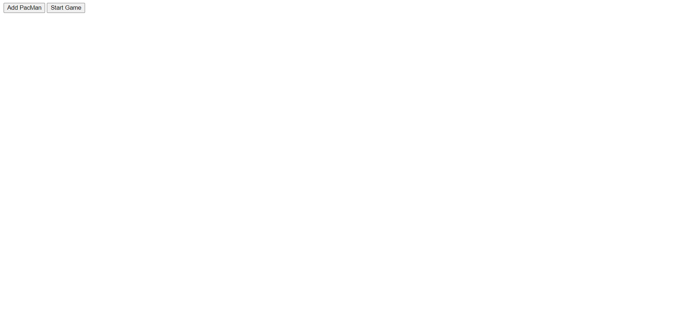
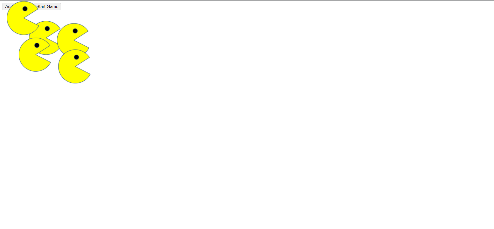
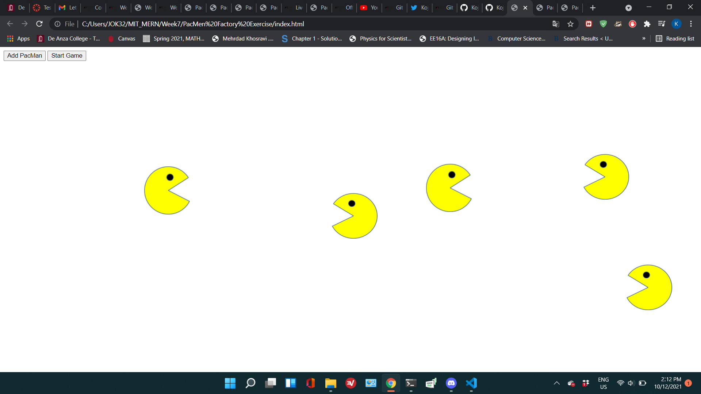

# PacMen_Exercise-Week7-

## Description:
  This is assignment from ***Professional Certificate in Coding: Full Stack Development with MERN*** Week7.
  This program consist of javascript, html, and img files.
  When you click the "Add pacman" then the pacman is created. When you click the "Start game" the pacmen stat to move.
  When the pacmen reach the edge of the screen, the pacmen change the direction of movement.

## Installation:
  1. Donloads each file into one file.  
    1. **images***(PacMan1.png, PacMan2.png, PacMan3.png, PacMan4.png)  
    2. **index.html**  
    3. **pacman.js**  
  2. Click **index.html** and run on the Web browser.
  
## Usage:
  
If successfully installed and run on the Web browser, the two button, "Add pacman" and "Start game" appear on the right cornor of the browser. 
  Then, Click the "Add pacman" as many as you want to add on the screen.  
  Add click the "Start game", then the pacmen start to move!!

  
## Support:
  If any question, message me via **[my twitter](https://twitter.com/Kojiro38895598)**.
  
## Roadmap:
  The update is not expected.
  
## License information: 
  
The most of the program is coded and contrubuted by MIT. If you use the part of this code in your program and show it to public, please include the name of ***MIT***.

